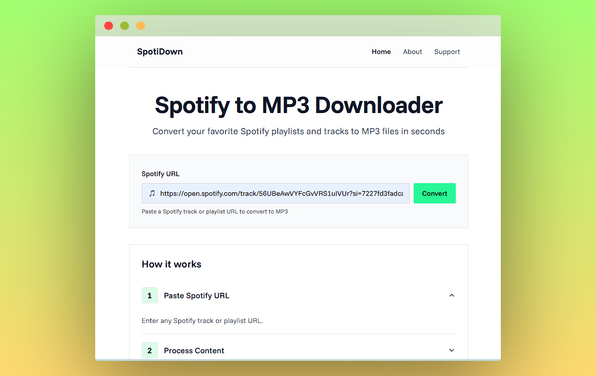

# SpotiDown



SpotiDown is a web application that converts Spotify tracks and playlists to MP3 files. It fetches metadata from Spotify, finds matching audio sources on YouTube, and provides MP3 downloads with proper metadata including title, artist, album, and cover art.

**Disclaimer:** This tool is intended for personal, private use only. Downloading copyrighted material without permission is illegal. SpotiDown is not affiliated with Spotify AB.

## Features

- Convert Spotify tracks and playlists to MP3
- Automatic metadata editing (title, artist, album, cover art)
- YouTube source matching
- Responsive design

## Tech Stack

- Next.js (App Router)
- TypeScript
- Tailwind CSS
- shadcn/ui
- Spotify Web API
- YouTube Data API
- RapidAPI (youtube-mp36)

## Getting Started

### Prerequisites

- Node.js (v18+)
- pnpm or npm/yarn
- API Keys:
  - Spotify Client ID & Secret
  - YouTube Data API Key
  - RapidAPI Key for youtube-mp36

### Installation

1. Clone the repository:

   ```bash
   git clone https://github.com/Manish-Tamang/spoti-down.git
   cd spoti-down
   ```

2. Install dependencies:

   ```bash
   pnpm install
   ```

3. Create `.env.local` file:

   ```
   SPOTIFY_CLIENT_ID=your_spotify_client_id
   SPOTIFY_CLIENT_SECRET=your_spotify_client_secret
   YOUTUBE_API_KEY=your_youtube_api_key
   RAPIDAPI_KEY=your_rapidapi_key
   NEXT_PUBLIC_APP_URL=http://localhost:3000
   ```

4. Start development server:

   ```bash
   pnpm dev
   ```

5. Open http://localhost:3000

## Contributing

Contributions are welcome! Fork the repository, create a feature branch, and submit a pull request.
